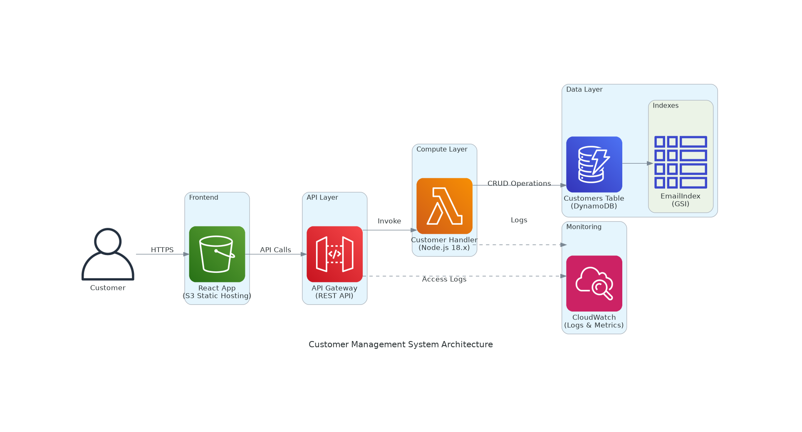

# Customer Information Management System

A comprehensive customer management system built with AWS CDK, featuring a React frontend and serverless backend architecture.

## 🚀 Live Demo

- **Frontend**: [http://customer-management-frontend-102220251812.s3-website-us-east-1.amazonaws.com](http://customer-management-frontend-102220251812.s3-website-us-east-1.amazonaws.com)
- **API**: [https://gat72i753g.execute-api.us-east-1.amazonaws.com/prod](https://gat72i753g.execute-api.us-east-1.amazonaws.com/prod)

## 📋 Project Overview

This project demonstrates a modern, scalable customer management system with the following features:

- **Customer Management**: Create, read, update, and delete customer records
- **Serverless Architecture**: Built on AWS Lambda and API Gateway
- **Modern Frontend**: React with TypeScript and Tailwind CSS
- **Infrastructure as Code**: AWS CDK for deployment and management
- **Comprehensive Documentation**: Architecture diagrams, cost analysis, and project planning

## 🏗️ Architecture

The system follows a serverless architecture pattern:

- **Frontend**: React SPA hosted on S3 with CloudFront distribution
- **Backend**: AWS Lambda functions with API Gateway
- **Database**: DynamoDB for customer data storage
- **Infrastructure**: Managed via AWS CDK



## 📁 Project Structure

```
customer-management-system-102220251812/
├── README.md                           # This file
├── DEPLOYMENT_SUMMARY.md              # Deployment information
├── workflow-log.txt                   # Project workflow log
├── test-system.js                     # System testing script
├── jira-stories-created.md            # Jira project documentation
├── specs/                             # Project specifications
│   ├── requirements.md                # Business requirements
│   ├── design.md                      # Technical design
│   └── tasks.md                       # Task breakdown
├── generated-diagrams/                # Architecture diagrams
│   ├── customer-management-architecture.png
│   ├── customer-management-api-flow.png
│   ├── customer-management-infrastructure.png
│   └── README.md
├── pricing/                           # Cost analysis
│   └── cost-analysis-report.md
├── tasks/                             # Task definitions
│   ├── spec-task.md
│   ├── diagram-task.md
│   ├── development-task.md
│   ├── pricing-task.md
│   ├── jira-task.md
│   └── github-task.md
├── cdk-app/                           # AWS CDK Infrastructure
│   ├── lib/
│   ├── bin/
│   ├── lambda/
│   └── test/
├── frontend/                          # React Frontend Application
│   ├── src/
│   ├── public/
│   └── build/
└── src/                              # Additional source files
```

## 🛠️ Technology Stack

### Frontend
- **React 18** with TypeScript
- **Tailwind CSS** for styling
- **Axios** for API communication
- **React Testing Library** for testing

### Backend
- **AWS Lambda** (Node.js 18.x)
- **API Gateway** for REST API
- **DynamoDB** for data persistence
- **AWS CDK** for infrastructure

### Development Tools
- **TypeScript** for type safety
- **Jest** for testing
- **ESLint** for code quality
- **AWS CLI** for deployment

## 🚀 Getting Started

### Prerequisites

- Node.js 18.x or later
- AWS CLI configured
- AWS CDK CLI installed (`npm install -g aws-cdk`)

### Installation

1. **Clone the repository**
   ```bash
   git clone <repository-url>
   cd customer-management-system-102220251812
   ```

2. **Install CDK dependencies**
   ```bash
   cd cdk-app
   npm install
   ```

3. **Install Frontend dependencies**
   ```bash
   cd ../frontend
   npm install
   ```

### Deployment

1. **Deploy the infrastructure**
   ```bash
   cd cdk-app
   npm run build
   cdk deploy
   ```

2. **Build and deploy frontend**
   ```bash
   cd ../frontend
   npm run build
   # Frontend is automatically deployed via CDK
   ```

### Local Development

1. **Start the frontend development server**
   ```bash
   cd frontend
   npm start
   ```

2. **Run tests**
   ```bash
   # CDK tests
   cd cdk-app
   npm test

   # Frontend tests
   cd ../frontend
   npm test
   ```

## 📊 API Endpoints

The system provides the following REST API endpoints:

- `GET /customers` - List all customers
- `POST /customers` - Create a new customer
- `GET /customers/{id}` - Get customer by ID
- `PUT /customers/{id}` - Update customer
- `DELETE /customers/{id}` - Delete customer

### Example API Usage

```javascript
// Create a customer
const response = await fetch('https://gat72i753g.execute-api.us-east-1.amazonaws.com/prod/customers', {
  method: 'POST',
  headers: {
    'Content-Type': 'application/json',
  },
  body: JSON.stringify({
    name: 'John Doe',
    email: 'john@example.com',
    phone: '+1234567890'
  })
});
```

## 💰 Cost Analysis

The system is designed to be cost-effective with a serverless architecture:

- **Estimated Monthly Cost**: $5-50 depending on usage
- **Pay-per-use model** for Lambda and API Gateway
- **Free tier eligible** for DynamoDB and S3

See [cost-analysis-report.md](./pricing/cost-analysis-report.md) for detailed cost breakdown.

## 📈 Monitoring and Observability

The system includes:

- **CloudWatch Logs** for application logging
- **CloudWatch Metrics** for performance monitoring
- **X-Ray Tracing** for distributed tracing (optional)
- **API Gateway Metrics** for API performance

## 🔒 Security Features

- **CORS** configuration for secure frontend-backend communication
- **Input validation** on all API endpoints
- **IAM roles** with least privilege access
- **VPC** deployment option for enhanced security

## 🧪 Testing

The project includes comprehensive testing:

- **Unit tests** for Lambda functions
- **Integration tests** for API endpoints
- **Frontend component tests**
- **End-to-end testing** script

Run the system test:
```bash
node test-system.js
```

## 📚 Documentation

- [Requirements](./specs/requirements.md) - Business requirements and user stories
- [Technical Design](./specs/design.md) - System architecture and design decisions
- [Task Breakdown](./specs/tasks.md) - Development task organization
- [Architecture Diagrams](./generated-diagrams/README.md) - Visual system documentation
- [Cost Analysis](./pricing/cost-analysis-report.md) - Detailed cost breakdown
- [Jira Integration](./jira-stories-created.md) - Project management documentation

## 🤝 Contributing

1. Fork the repository
2. Create a feature branch (`git checkout -b feature/amazing-feature`)
3. Commit your changes (`git commit -m 'Add some amazing feature'`)
4. Push to the branch (`git push origin feature/amazing-feature`)
5. Open a Pull Request

## 📝 License

This project is licensed under the MIT License - see the LICENSE file for details.

## 🆘 Support

For support and questions:

1. Check the [documentation](./specs/)
2. Review the [architecture diagrams](./generated-diagrams/)
3. Run the [system test](./test-system.js)
4. Check [deployment summary](./DEPLOYMENT_SUMMARY.md)

## 🎯 Future Enhancements

- User authentication and authorization
- Advanced search and filtering
- Data export functionality
- Mobile application
- Real-time notifications
- Advanced analytics dashboard

---

**Stack Name**: CustomerManagementStack-102220251812  
**Deployment Date**: October 22, 2025  
**Version**: 1.0.0
